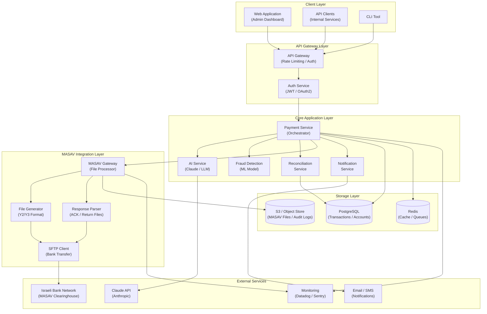
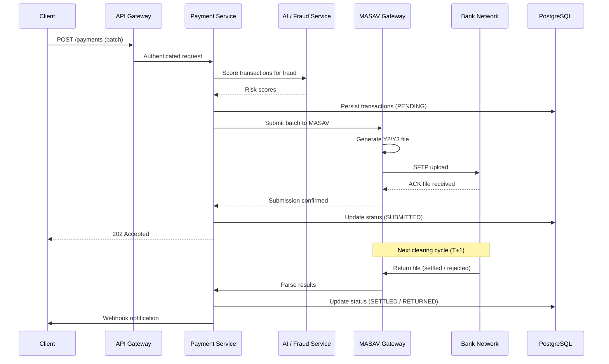

# masav-ai Architecture

## Overview

**masav-ai** is an AI-powered payment processing system that integrates with MASAV (מסב — Israeli Automated Bank Services), enabling intelligent direct debit and credit transfer operations with fraud detection, reconciliation, and natural language querying capabilities.

---

## System Architecture Diagram

---

## Component Descriptions

### Client Layer
| Component | Description |
|-----------|-------------|
| **Web Application** | Admin dashboard for managing payments, viewing transaction history, and AI-assisted queries |
| **API Clients** | Internal microservices consuming the payment API (e.g., billing, subscriptions) |
| **CLI Tool** | Developer/ops tool for triggering batch jobs and manual reconciliation |

### API Gateway Layer
| Component | Description |
|-----------|-------------|
| **API Gateway** | Single entry point; handles rate limiting, request routing, and TLS termination |
| **Auth Service** | Issues and validates JWT tokens; integrates with OAuth2/SSO providers |

### Core Application Layer
| Component | Description |
|-----------|-------------|
| **Payment Service** | Central orchestrator; manages the full lifecycle of a payment instruction |
| **AI Service** | Wraps the Claude API; handles natural language queries, anomaly explanations, and smart categorization |
| **Fraud Detection** | ML-based model scoring transactions before submission to MASAV |
| **Reconciliation Service** | Matches MASAV return files against internal transaction records |
| **Notification Service** | Sends payment status updates to customers and operators |

### MASAV Integration Layer
| Component | Description |
|-----------|-------------|
| **MASAV Gateway** | Core integration; manages the MASAV file lifecycle (create → send → receive → parse) |
| **File Generator** | Produces Y2 (debit) / Y3 (credit) formatted files per MASAV specification |
| **Response Parser** | Parses ACK and return files from the bank clearinghouse |
| **SFTP Client** | Securely transfers files to/from the bank's SFTP server |

### Storage Layer
| Component | Description |
|-----------|-------------|
| **PostgreSQL** | Primary datastore for transactions, accounts, mandates, and audit trails |
| **Redis** | Caching layer and message queue (Bull/BullMQ) for async processing |
| **S3 / Object Store** | Long-term storage for raw MASAV files and compliance audit logs |

### External Services
| Service | Description |
|---------|-------------|
| **Israeli Bank Network** | MASAV clearinghouse operated by the Bank of Israel |
| **Claude API (Anthropic)** | LLM backend for the AI service features |
| **Email / SMS** | Customer-facing notifications on payment status |
| **Monitoring** | Observability stack for metrics, errors, and alerting |

---

## Data Flow — Payment Submission

---

## Technology Stack

| Layer | Technology |
|-------|-----------|
| Runtime | Node.js / TypeScript |
| Framework | NestJS or Express |
| Database | PostgreSQL + Prisma ORM |
| Cache / Queue | Redis + BullMQ |
| File Storage | AWS S3 / MinIO |
| AI | Anthropic Claude API |
| Auth | JWT + OAuth2 |
| MASAV Protocol | Custom SFTP + Y2/Y3 file format |
| Containerization | Docker + Docker Compose |
| Orchestration | Kubernetes (production) |
| CI/CD | GitHub Actions |
| Monitoring | Datadog / Sentry |
